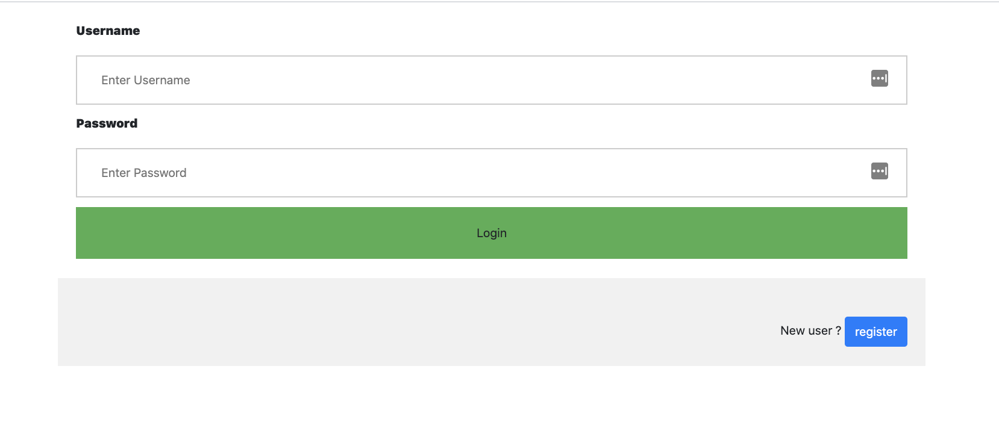
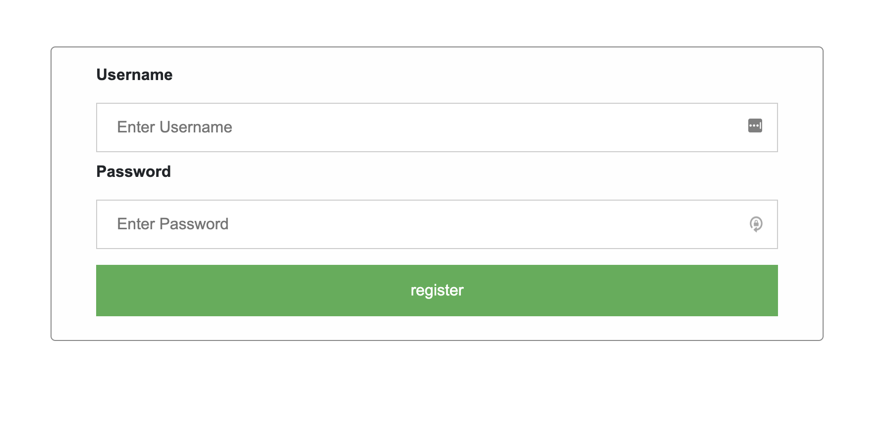
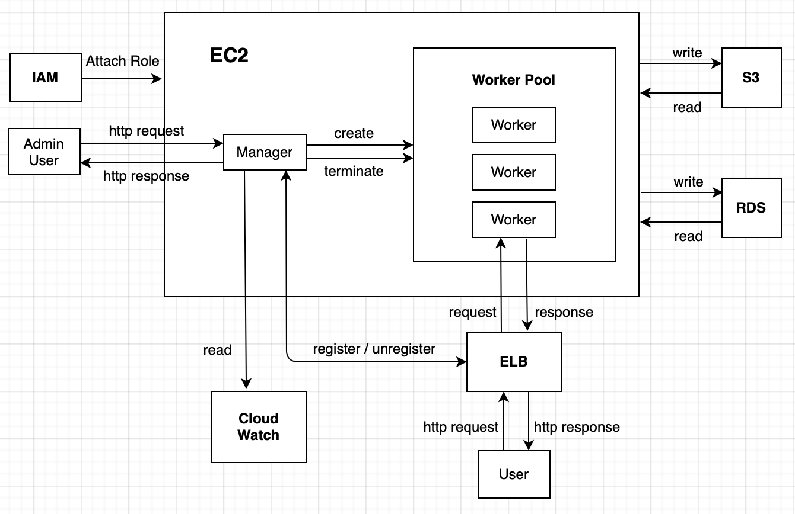

# ece1779-a2

## Overview
This project is a python-based web application that allows users to upload images and get the processed ones with objects detected. The application is deployed by gunicorn on a single EC2 and is set to run on port 5000. (http://54.159.34.94:5000)

## Group members
* Hongyu Liu 1005851295   
* Ran Wang 1006126951   
* Zixiang Ma 1005597285  

## Quick Start

### Access to AWS EC2 instance
use the command below to access EC2 instance. The project is placed at root directory and please use the start up script to launch. 
```
ssh -i "keypair.pem" ubuntu@ec2-54-159-34-94.compute-1.amazonaws.com
```

### Start Server

To start the deployed server on EC2, execute the start up script at Desktop directory with command below. 
```
~/Desktop/$ sudo bash start.sh
```

## Major Dependencies
```
Python 3.7
Flask 1.1.1
Gunicorn 20.0.4
``` 

## Web interface

### Authentication view
Users are required to be authenticated before uploading images. Unauthenticated accesses will be redirected to the login page. 
  

During registration, users should provide a unique username and a password. Username should have 2 to 100 characters, and contains only letters, numbers, dash and underscore. Password should have 6 or more characters. Validation of username and password is performed on server end. Users will be redirected to the login page upon successful registration. 
  

### Profile view
Users will be redirected to profile upon successful login. The profile view contains an image upload form and a gallery of thumbnails of the processed images. Users can select an image file and click on the upload button to add a new image to the profile. In the gallery section, users can only view the images uploaded by themselves.
  

### Image view
By clicking on the thumbnails, users will be redirected to the image page that shows the original image and the image processed by the object detection modules. 
  

## API Interface

This application exposes two endpoints below for testing purposes.   
  ### Registration
  This endpoint accepts HTTP POST requests to register a user. There are two string parameters in this request: username and password. The endpoint will return a login HTML view with code 201 upon successful registration. If the parameters are not in the requested format, a flash message will ask users to change username and password format, code 200 will be returned.

  * Request URL: http://host/api/register    
  * HTTP method: POST    
  * Request parameters  
    * username - String 
    * password - String
  * Response: - JSON
  ~~~
    {
      'isSuccess': True,
      'url': url_for('user.login')
    }

    {
      'isSuccess': False,
      'message': "error message"
    }
    ~~~

  ### Image
  
  This endpoint accepts HTTP POST requests to add an image to user's gallery. This request should include two string parameters: username and password; and a file parameter: file. The enctype property of this request should be set to multipart/form-data.
  * Request URL: http://host/api/upload
  * HTTP method: POST
  * Request parameters
    * username - String
    * password - String
    * file - file
  * Response - JSON
    ~~~
    {
      success: true
    }

    {
      success: false,
      message: "error message"
    }
    ~~~

## System Architectures
The web pages act as the client and send requests to and gets responses from the server deployed on an instance of AWS EC2. The gunicorn application server is set up to launch the flask web application at port 5000. The flask web application communicates with the db at port 3306.
 

## Database
There are two tables in the db. The user table takes username as the primary key and it stores users' credential information. The password stored is the hash of the original password concatenated with a per-user salt value. The image table has an id incremented automatically and a foreign key referenced from the username in the user table. The image table also contains some image information, like the storage location of the image, the timestamp and the type of the image(i.e. original, processed or thumbnail). This db follows the 3NF.
 

## Results


## Error Handling

* 404 Not Found
* 403 Forbidden
* 401 Unauthorized 
* 400 Bad Request

## Assumptions
* Image Format: this application only accept format accepted by open cv framework, including bmp, pbm, pgm, ppm, sr, ras, jpeg, jpg, jpe, jp2, tiff, tif, png. The format should be explicitly identified as file extension. 

## Contribution of each member 
* Hongyu Liu 1005851295

* Ran Wang 1006126951

* Zixiang Ma 1005597285
  
